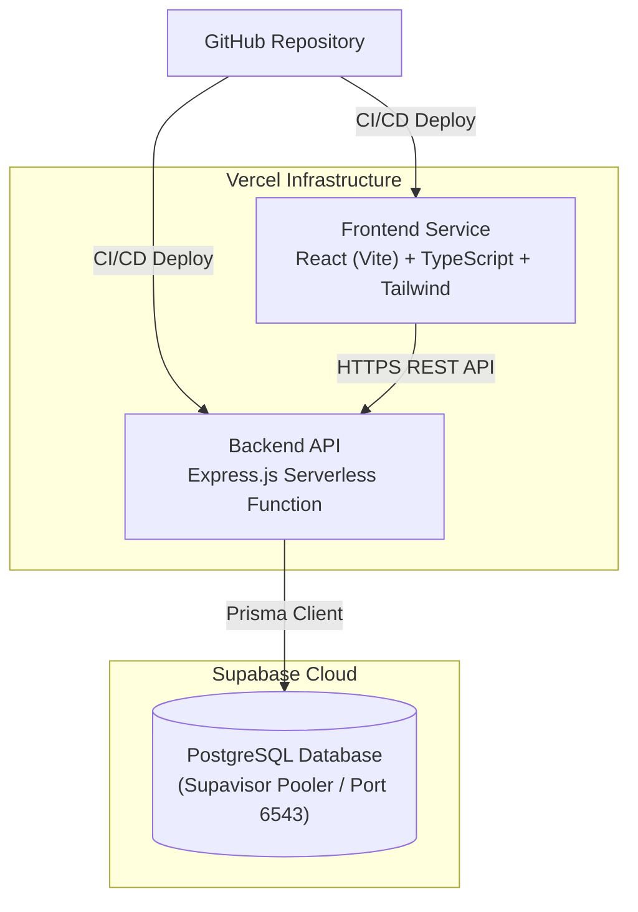
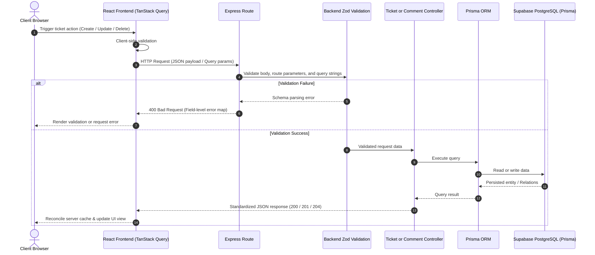

# Mini Service Ticket Management System

A full-stack service ticket management application built with React, Express, Prisma ORM, and Supabase PostgreSQL. Supports ticket creation, lifecycle tracking, search, multi-factor filtering, server-side sorting, pagination, ticket comments with cascade deletion, optimistic UI updates, and automated API integration testing.

Deployed in a decoupled serverless architecture on Vercel and Supabase.

---

## Live Links

* **Frontend Application:** https://mini-ticket-system-frontend.vercel.app
* **Backend API Base:** https://mini-ticket-system-backend.vercel.app
* **API Health Check:** https://mini-ticket-system-backend.vercel.app/api/health

---

## Architecture

### System Topology



### Request Flow & Validation Boundary



The application uses a serverless architecture where the Express API runs as a Node.js function on Vercel without requiring an always-on VM. Runtime queries use Supabase's transaction pooler (`port 6543`), which is well suited to serverless workloads and helps manage database connections efficiently.

---

## Quick Start (Local Setup)

### Prerequisites
* **Node.js:** 20.19+ recommended
* **npm:** v9+
* **PostgreSQL:** Running locally or a remote Supabase instance
* **Git**

### 1. Clone the Repository
```bash
git clone git@github.com:Madhukesh2005/mini-ticket-system.git
cd mini-ticket-system
```

### 2. Configure Backend Environment
Create `backend/.env`:
```env
DATABASE_URL="your_supabase_pooled_connection_string"
DIRECT_URL="your_supabase_direct_connection_string"
PORT=5000
NODE_ENV=development
```

`DATABASE_URL` is used by the application at runtime.  
`DIRECT_URL` is used by Prisma configuration and database tooling.

### 3. Initialize Database & Run Backend
```bash
cd backend
npm install
npx prisma generate
npx prisma migrate deploy
npm run dev
```
* **Local Backend:** `http://localhost:5000`
* **Health Check:** `http://localhost:5000/api/health`

### 4. Run Frontend
Open a separate terminal window:
```bash
cd mini-ticket-system/frontend
npm install
npm run dev
```
* **Local Frontend:** `http://localhost:5173`
*(If `VITE_API_URL` is unset, the frontend uses the Vite `/api` proxy to `http://localhost:5000`. If `VITE_API_URL` is set, the frontend calls that API URL directly.)*

---

## Features

* **Full CRUD Operations:** Create tickets, view ticket details, update status/priority, and delete tickets.
* **Server-Side Filtering & Search:** Filter by `status`, `priority`, and `customer`, with case-insensitive search across ticket titles and customer names.
* **Database Pagination & Sorting:** Database-level pagination using `page` and `limit`, with customizable sorting by `createdAt`, `updatedAt`, `priority`, `status`, `title`, and `customerName`.
* **Nested Comments System:** 1-to-many relational comment model per ticket with author tracking and automatic cascade deletion.
* **Optimistic UI Updates:** Deletion actions trigger immediate UI removal with automatic state rollbacks if the network request fails.
* **Resilient UI States:** Dedicated loading skeletons, empty data screens, and an overarching React Error Boundary to catch render failures.

---

## Bonus Features Implemented

* Database-level pagination with metadata response
* Dynamic sorting by supported fields (`asc` / `desc`)
* Ticket comments with cascade relationship handling
* Optimistic UI updates on deletion mutations with automatic rollback
* TypeScript across the application code
* Automated backend API integration testing (Vitest + Supertest)
* Responsive design across mobile, tablet, and desktop breakpoints
* React Error Boundary integration for graceful UI error recovery

---

## Database Model & Relationships

```text
+------------------------------------+          +------------------------------------+
|               Ticket               |          |              Comment               |
+------------------------------------+          +------------------------------------+
| id           : String (UUID, PK)   | 1      N | id        : String (UUID, PK)      |
| customerName : String              |<--------+| ticketId  : String (FK, Cascade)   |
| title        : String              |          | author    : String                 |
| description  : String              |          | message   : String                 |
| priority     : Priority (Enum)     |          | createdAt : DateTime               |
| status       : Status (Enum)       |          +------------------------------------+
| createdAt    : DateTime            |
| updatedAt    : DateTime            |
+------------------------------------+
```

### Relationship Design
* **1-to-Many Cascade:** `Ticket 1 ─────────── N Comment`. Each comment belongs to a ticket via `ticketId`. When a ticket is deleted, all child comments are deleted automatically via PostgreSQL foreign key cascade constraints (`onDelete: Cascade`).
* **Performance Indexing:** B-Tree indexes on `status`, `priority`, and `createdAt` to support common filtering and sorting queries.

---

## REST API Reference

### Base URL: `/api`

| Method | Endpoint | Description |
| :--- | :--- | :--- |
| `GET` | `/health` | Service and database health status |
| `GET` | `/tickets` | List tickets with support for filtering, search, sorting, and pagination |
| `POST` | `/tickets` | Create a new ticket (validates customer name, title, description, priority) |
| `GET` | `/tickets/:id` | Fetch single ticket details by UUID |
| `PUT` | `/tickets/:id` | Update ticket fields (title, description, status, priority) |
| `DELETE` | `/tickets/:id` | Delete ticket and cascade-delete associated comments |
| `GET` | `/tickets/:id/comments` | Retrieve all comments attached to a ticket |
| `POST` | `/tickets/:id/comments` | Post a new comment to a ticket (`author`, `message`) |

### Query Parameters (`GET /api/tickets`)
```text
?status=OPEN&priority=HIGH&search=billing&page=1&limit=10&sortBy=createdAt&order=desc
```

### Response Formats

#### Success (`200 OK` / `201 Created`)
```json
{
  "success": true,
  "data": {
    "id": "e4b6c318-771c-4b95-a4f6-8c4d29a59b21",
    "customerName": "Alice Johnson",
    "title": "Database connection drop",
    "description": "App loses connection to pooler during traffic spike.",
    "priority": "HIGH",
    "status": "OPEN",
    "createdAt": "2026-09-08T12:00:00.000Z",
    "updatedAt": "2026-09-08T12:00:00.000Z"
  }
}
```

#### Pagination Metadata (`GET /api/tickets`)
```json
{
  "success": true,
  "data": [ ... ],
  "pagination": {
    "page": 1,
    "limit": 10,
    "total": 42,
    "totalPages": 5
  },
  "stats": {
    "OPEN": 0,
    "IN_PROGRESS": 0,
    "RESOLVED": 0,
    "CLOSED": 0
  }
}
```

#### Validation Failure (`400 Bad Request`)
```json
{
  "success": false,
  "message": "Validation failed",
  "errors": {
    "title": "Title must be at least 3 characters",
    "priority": "Invalid enum value. Expected 'LOW' | 'MEDIUM' | 'HIGH'"
  }
}
```

---

## Technology Stack

| Layer | Technology | Usage |
| :--- | :--- | :--- |
| **Frontend** | React, Vite, TypeScript | SPA framework, build tooling, and static typing |
| **Styling** | Tailwind CSS, Lucide React | Responsive layout utilities and iconography |
| **State & Fetching** | TanStack Query v5 | Server state caching, background refetching, optimistic mutations |
| **Forms & Validation** | React Hook Form, Zod | Type-safe form controllers and UX validation |
| **Error Isolation** | React Error Boundary | Top-level render fallback protection |
| **Backend Runtime** | Node.js, Express, TypeScript | REST API service running on Vercel Serverless |
| **API Validation** | Zod | Runtime validation of request bodies, query parameters, and route parameters |
| **Database & ORM** | Supabase PostgreSQL, Prisma | Managed PostgreSQL instance, migrations, and typed queries |
| **Testing** | Vitest, Supertest | Integration and HTTP endpoint test suites |

---

## Project Structure

```text
mini-ticket-system/
├── backend/
│   ├── prisma/
│   │   ├── migrations/          # Versioned database migrations
│   │   └── schema.prisma        # Prisma models, enums, and relations
│   ├── src/
│   │   ├── controllers/         # Ticket and comment request handlers
│   │   ├── generated/           # Generated Prisma client (git-ignored)
│   │   ├── lib/                 # Prisma client configuration
│   │   ├── middleware/          # Centralized error handling
│   │   ├── routes/              # Express route definitions
│   │   ├── tests/               # Vitest + Supertest integration tests
│   │   ├── validators/          # Zod validation schemas
│   │   ├── app.ts               # Express application configuration
│   │   └── server.ts            # Local development server entry point
│   ├── prisma.config.ts         # Prisma datasource configuration
│   ├── tsconfig.json
│   └── package.json
├── frontend/
│   ├── src/
│   │   ├── api/                 # HTTP request functions
│   │   ├── components/          # Reusable UI components
│   │   ├── hooks/               # TanStack Query and reusable hooks
│   │   ├── types/               # TypeScript type definitions
│   │   ├── App.tsx              # Main dashboard
│   │   └── main.tsx             # Application entry point
│   ├── vite.config.ts           # Vite configuration and dev proxy
│   ├── tsconfig.json
│   └── package.json
├── .gitignore
└── README.md
```

---

## Automated Testing & Quality Assurance

Integration tests are executed using **Vitest** and **Supertest** against the Express application layer with an in-memory Prisma mock. They do not connect to Supabase or any production database.

Run backend tests:
```bash
cd backend
npm test
```

### Verified Test Cases

* **System Health:** Confirms `GET /api/health` returns `200 OK`.
* **Input Validation:** Verifies invalid ticket request data is rejected with `400 Bad Request`.
* **Query Mechanics:** Verifies query validation and ticket filtering behavior.
* **CRUD Lifecycle:** Verifies ticket creation, retrieval, update, filtering, deletion, and post-deletion `404 Not Found` behavior.
* **Comment Lifecycle:** Verifies comment creation, retrieval, validation, and cascade deletion with tickets.

---

## Deployment Setup

The application is deployed across two independent Vercel projects linked to the same monorepo:

### Backend Deployment
* **Platform:** Vercel (Express on Node.js / Vercel Functions)
* **Root Directory:** `backend`
* **Node.js Runtime:** 24.x
* **Environment Variables:** `DATABASE_URL`, `DIRECT_URL`, `FRONTEND_URL`
* **Live Base URL:** https://mini-ticket-system-backend.vercel.app

### Frontend Deployment
* **Platform:** Vercel (Static Vite SPA)
* **Root Directory:** `frontend`
* **Environment Variables:** `VITE_API_URL=https://mini-ticket-system-backend.vercel.app/api`
* **Live Base URL:** https://mini-ticket-system-frontend.vercel.app